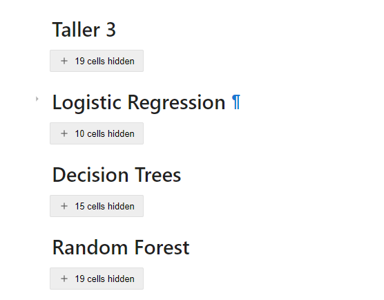
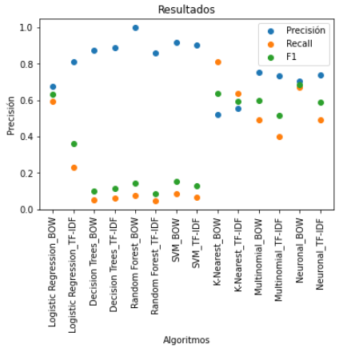

Big Data Analytics.
 
Universidad el bosque.
 
Nombre: Carlos Niño.
 
Profesor: Fabian Peña. 

---------------------------

    :page_facing_up: TALLER 3

:pushpin: Consideraciones

   
  1. Bajar el taller para abrirlo desde jupyter-lab ya que en github no se pueden colapsar las secciones, en vez en jupyter si:
     
   
     
  2. El archivo con los datos utilizados se encuentra en la carpeta: <a href="./Taller3/data/">/Taller3/data/</a>
     
  3. El taller resuelto se encuentra en la carpeta <a href="./Taller3/">/Taller3/</a>
     

   
Resultados:
   

   
Video: 
